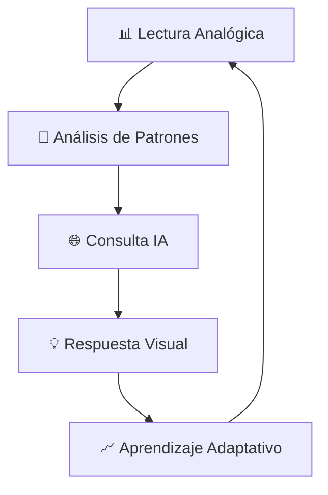

# 🤖 FANAX
### *Asistente Personal Inteligente de Escritorio*

> **EXPOCENFO-2025** | Un proyecto que transforma tu espacio de trabajo con inteligencia artificial embebida

---

## 🎯 ¿Qué es FANAX?

FANAX es un **asistente personal inteligente** diseñado para revolucionar tu productividad utilizando tecnología accesible. Con solo un **ESP32** y sensores básicos, FANAX se adapta a tu entorno de trabajo, monitoreando tus hábitos y ofreciendo sugerencias personalizadas para mejorar tu enfoque y rendimiento.

### Características Principales

- **IA Contextual Embebida** - Procesamiento inteligente local con conexión a la nube
- **Monitoreo de Patrones** - Detecta automáticamente tus hábitos de trabajo
- **Retroalimentación Visual** - Comunicación a través de LED inteligentes
- **Conectividad IoT** - Integración con APIs de IA modernas
- **Sistema Adaptativo** - Aprende y evoluciona con tu rutina

---

##🎯 Problemática

### El Desafío
- **Espacios de trabajo "tontos"**: Falta de soluciones inteligentes de bajo costo
- **Barreras económicas**: Asistentes actuales requieren hardware costoso o suscripciones
- **Falta de personalización**: Soluciones genéricas que no se adaptan al usuario individual

### La Oportunidad
Democratizar el acceso a asistentes personales inteligentes utilizando hardware accesible y tecnología de vanguardia.

---

## 📌 Objetivos

### 📍 Objetivo General
Desarrollar un asistente embebido minimalista que utilice un **ESP32** y sensores básicos para monitorear patrones del usuario y ofrecer recomendaciones personalizadas mediante interfaz visual y conectividad con servicios de IA en la nube.

### 📍 Objetivos Específicos

| Objetivo | Descripción |
|----------|-------------|
| 🎛**Interacción Simulada** | Implementar potenciómetro como entrada analógica para simular actividad del usuario |
| **Monitoreo Ambiental** | Utilizar ADC del ESP32 para patrones de monitoreo básico |
| **Integración IA** | Conectar con APIs (OpenAI/Gemini) para recomendaciones inteligentes |
| **Interfaz Visual** | Sistema de comunicación mediante LED integrado o RGB externo |
| **Rutina Adaptativa** | Algoritmo de aprendizaje basado en patrones y repeticiones |

---

## ⚙️ Funcionalidades

### 🔧 Core Features

- **📊 Monitoreo Continuo**: Lectura analógica mediante potenciómetro para simular actividad/estado del usuario
- **🎯Detección de Patrones**: Algoritmos para identificar hábitos como duración de sesiones e interrupciones
- **🌐 IA en la Nube**: Conexión WiFi y peticiones HTTP a modelos de lenguaje para sugerencias contextuales
- **💡Feedback Visual**: Sistema de LED para indicar estados de concentración, distracción o cambios de rutina
- **🚀Escalabilidad**: Arquitectura preparada para integrar sensores reales en futuras versiones

###💬 Ejemplos de Sugerencias IA
- *"Es hora de tomar un descanso, llevas 2 horas concentrado"*
- *"Perfecto momento para retomar el trabajo"*
- *"Tu productividad es mayor en las mañanas"*

---

## 🔬 Innovaciones Técnicas

### 🚀 Tecnologías Disruptivas

| Innovación | Impacto |
|------------|---------|
| **IA Contextual Embebida** | Primera implementación de IA conversacional en sistemas con E/S limitada |
| **Retroalimentación Visual Inteligente** | Patrones de comunicación LED basados en lógica adaptativa |
| **ESP32 como Puente IoT-IA** | Conexión directa entre entorno físico y servicios de IA en la nube |
| **Aprendizaje de Patrones Simples** | Algoritmos de ML optimizados para microcontroladores |

---

## 🛠️ Stack Tecnológico Recomendado 
🔧 Hardware
├── ESP32 (Microcontrolador principal)
├── Potenciómetro (Simulación de entrada)
├── LED RGB (Interfaz visual)
└── Componentes básicos Y sensores
💻 Software
├── ESP-IDF / Arduino IDE
├── WiFi Manager
☁️ Servicios
├── OpenAI API / Google Gemini
├── WiFi Connectivity
└── Cloud Processing

## 🎯 Roadmap

### Fase 1: Prototipo Base ✅
- [x] Configuración ESP32
- [x] Lectura analógica básica
- [x] Conectividad WiFi

### Fase 2: Integración IA 🚧
- [x] Conexión con APIs de IA
- [x] Sistema de patrones básico

### Fase 3: Optimización 📋
- [x] Algoritmos de aprendizaje
- [x] Mejoras en UI visual
- [x] Documentación completa

### Fase 4: Expansión 🔮
- [x] Sensores reales
- [x] Presentación
- [x] Carcasa y personalización

---

## 🤝 Contribuciones

El proyecto es completamente Open Source, por lo que cualquier contribución, recomendación o idea es bienvenida
###Formas de colaborar
1. Fork el repositorio
2. Crea tu feature branch
3. Commit tus cambios
4. Push al branch
5. Abre un Pull Request

---

## 👥 Equipo

**EXPOCENFO-2025** | Integrantes: Axel Chaves, Andrés Melendez, Fabián Vargas

---

### ¡Esperamos les guste nuestro proyecto! 

**FANAX** 

